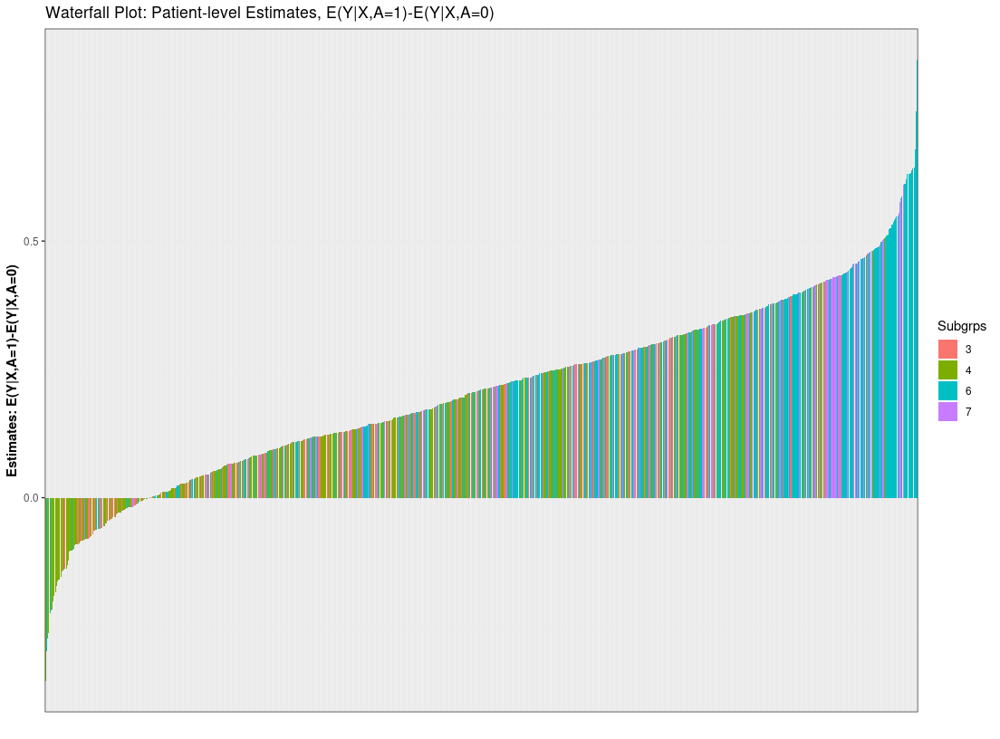
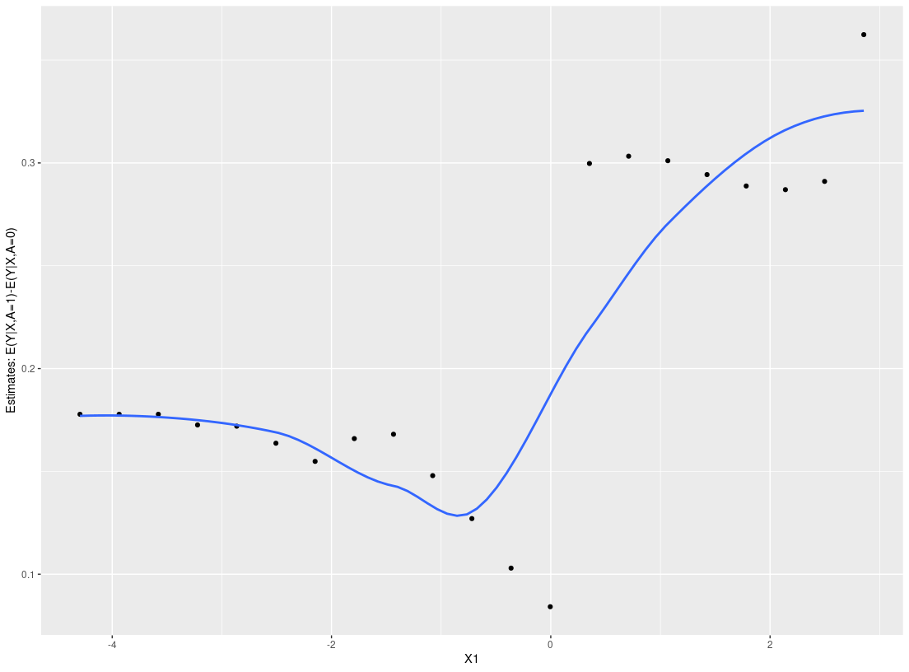

<!-- README.md is generated from README.Rmd. Please edit that file -->
StratifiedMedicine
==================

<!-- badges: start -->
<!-- badges: end -->
The goal of StratifiedMedicine is to develop analytic and visualization tools to aid in stratified and personalized medicine. Stratified medicine aims to find subsets or subgroups of patients with similar treatment effects, for example responders vs non-responders, while personalized medicine aims to understand treatment effects at the individual level (does a specific individual respond to treatment A?). Development of this package is ongoing.

Currently, the main tools in this package area: (1) Filter Models (identify important variables and reduce input covariate space), (2) Patient-Level Estimate Models (using regression models, estimate counterfactual quantities, such as the individual treatment effect), (3) Subgroup Models (identify groups of patients using tree-based approaches), and (4) Parameter Estimation (across the identified subgroups), and (5) PRISM (Patient Response Identifiers for Stratified Medicine; combines tools 1-4). Development of this package is ongoing.

Given a data-structure of (Y,A,X) (outcome, treatments, covariates), PRISM is a five step feature, which comprise of individual tools mentioned above:

1.  **Filter (filter\_train)**: Reduce covariate space by removing variables unrelated to outcome/treatment.

2.  **Patient-level estimate (ple\_train)**: Estimate counterfactual patient-level quantities, for example the individual treatment effect, *θ*(*x*)=*E*(*Y*|*X* = *x*, *A* = 1)−*E*(*Y*|*X* = *x*, *A* = 0).

3.  **Subgroup model (submod\_train)**: Tree-based models to identify groups with hetergenous treatment effects (ex: responder vs non-responder)

4.  **Parameter estimation and inference (param\_est)**: For the overall population and discovered subgroups, output point estimates and variability metrics. These outputs are crucial for Go-No-Go decision making.

5.  **Resampling**: Steps 1-4 are repeated through bootstrap resampling for improved parameter estimation and inference.

Installation
------------

You can install the released version of StratifiedMedicine from [CRAN](https://CRAN.R-project.org) with:

``` r
install.packages("StratifiedMedicine")
```

And the development version from [GitHub](https://github.com/) with:

``` r
# install.packages("devtools")
devtools::install_github("thomasjemielita/StratifiedMedicine")
```

Example: Continuous Outcome with Binary Treatment
-------------------------------------------------

Suppose the estimand or question of interest is the average treatment effect, *θ*<sub>0</sub> = *E*(*Y*|*A* = 1)−*E*(*Y*|*A* = 0). The goal is to understand whether there is any treatment heterogeneity across patients and if there are any distinct subgroups with similar responses. In this example, we simulate continuous data where roughly 30% of the patients receive no treatment-benefit for using *A* = 1 vs *A* = 0. Responders vs non-responders are defined by the continuous predictive covariates *X*<sub>1</sub> and *X*<sub>2</sub> for a total of four subgroups. Subgroup treatment effects are: *θ*<sub>1</sub> = 0 (*X*<sub>1</sub> ≤ 0, *X*<sub>2</sub> ≤ 0), *θ*<sub>2</sub> = 0.25(*X*<sub>1</sub> &gt; 0, *X*<sub>2</sub> ≤ 0), *θ*<sub>3</sub> = 0.45(*X*<sub>1</sub> ≤ 0, *X*2 &gt; 0), *θ*<sub>4</sub> = 0.65(*X*<sub>1</sub> &gt; 0, *X*<sub>2</sub> &gt; 0).

``` r
library(StratifiedMedicine)
## basic example code
dat_ctns = generate_subgrp_data(family="gaussian")
Y = dat_ctns$Y
X = dat_ctns$X # 50 covariates, 46 are noise variables, X1 and X2 are truly predictive
A = dat_ctns$A # binary treatment, 1:1 randomized 

# Filter #
res_f <- filter_train(Y, A, X, filter="glmnet")
plot_importance(res_f)
```


``` r

# counterfactual estimates (ple) #
res_p <- ple_train(Y, A, X, ple="ranger")
plot_dependence(res_p, X=X, vars="X1")
#> `geom_smooth()` using method = 'loess' and formula 'y ~ x'
```


``` r

# PRISM Default: filter_glmnet, ple_ranger, submod_lmtree, param_ple #
res0 = PRISM(Y=Y, A=A, X=X)
#> Observed Data
#> Filtering: glmnet
#> PLE: ranger
#> Subgroup Identification: lmtree
#> Parameter Estimation: dr
plot(res0) # default: tree plot 
```


``` r
plot(res0, type="PLE:waterfall") # waterfall plot of PLEs
```


``` r

## Dependence Plots (univariate and heat maps)
plot_dependence(res0, vars="X1")
#> `geom_smooth()` using method = 'loess' and formula 'y ~ x'
```



``` r
plot_dependence(res0, vars="X2")
#> `geom_smooth()` using method = 'loess' and formula 'y ~ x'
```



``` r
plot_dependence(res0, vars=c("X1", "X2"))
```


Overall, StratifiedMedicine provides information at the patient-level, the subgroup-level (if any), and the overall population. While there are defaults in place, the user can also input their own functions/model wrappers into each of the individual tools. For more details and more examples, we refer the reader to the following vignettes, [SM\_overview](https://CRAN.R-project.org/package=StratifiedMedicine/vignettes/SM_PRISM.html), [User\_Specific\_Models](https://CRAN.R-project.org/package=StratifiedMedicine/vignettes/SM_User_Models.html).
